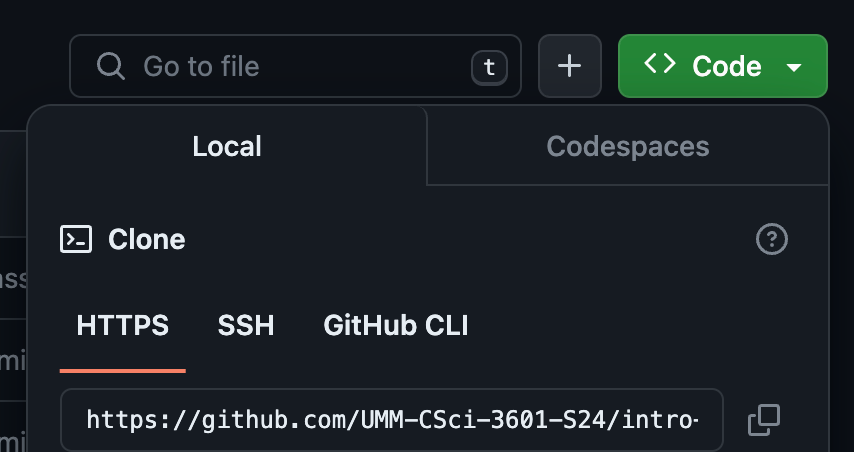
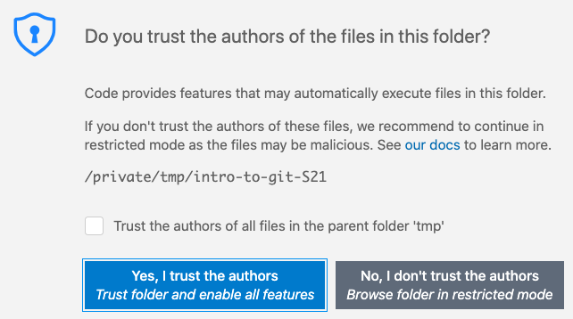
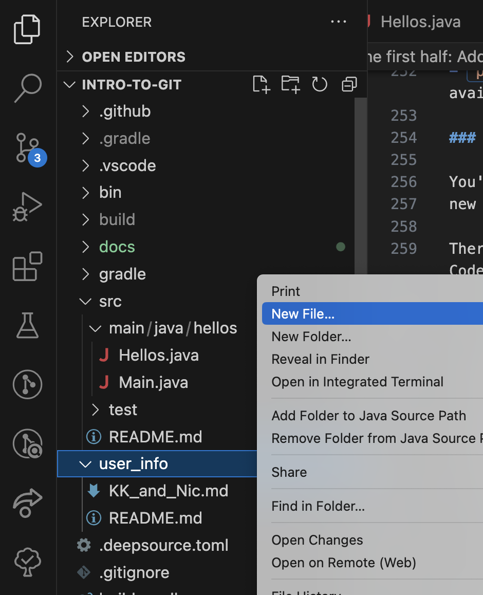

# The first half: Adding our names <!-- omit in toc -->

- [`clone` a local copy of the repository](#clone-a-local-copy-of-the-repository)
  - [Join our GitHub Classroom team; get your clone URL](#join-our-github-classroom-team-get-your-clone-url)
  - [Command line `clone`](#command-line-clone)
- [Using `gradle` to run tasks](#using-gradle-to-run-tasks)
- [Opening our project in VS Code](#opening-our-project-in-vs-code)
  - [Trust us, really](#trust-us-really)
  - [Install recommended extensions](#install-recommended-extensions)
  - [Have a look at the project](#have-a-look-at-the-project)
- [Create an info page for each group](#create-an-info-page-for-each-group)
  - [Creating a page](#creating-a-page)
  - [`commit` your changes (locally)](#commit-your-changes-locally)
  - [`push`ing your work to GitHub](#pushing-your-work-to-github)
    - [Personal Access Tokens](#personal-access-tokens)
    - [Back to `git push`](#back-to-git-push)

In this part of the lab we'll add everyone's names and GitHub usernames to the
repository so we'll be able to figure out who GitHub user `MightyWombat259`
is in real life.

> :exclamation: :mage_woman: **Faculty** need to make sure that
> [branch protection check and review requirements are _off_](docs/FACULTY_BRANCH_PROTECTION_SETTINGS.md)
> for this first part of the lab or students won't be
> able to push directly to `main`

## `clone` a local copy of the repository

Before we can start working on the lab proper, each group will need to
`clone` the GitHub repository so they have a local copy to work with. There
will only be one copy of the repository on GitHub, but each group should obtain
a clone on whatever machine they're working on, so there will be lots of
local copies. Each of those local copies will be completely independent, and
will only share changes through explicit interactions with the GitHub
repository through `git`.

### Join our GitHub Classroom team; get your clone URL

We'll be using [GitHub Classroom](https://classroom.github.com) all semester
to manage team repositories.
For each project we'll post a GitHub Classroom URL on the assignment on Canvas;
you'll use that to create/join your team for that lab. GitHub Classroom
will create a copy on GitHub for your team of our starter
repository; your team will use that as the starting point for your work.

This lab is unusual in that we will all be on a single large team called
**Everyone**, all making changes to a single shared repository. This will
help illustrate the value of version control systems like `git` in managing
this kind of shared resource, and also give us opportunities to see what
happens when different people make inconsistent changes to the same files.

So follow the link in the Canvas assignment and join the **Everyone** team;
that should take you to the shared repository on GitHub. From there
you can get the URL for that repository
from the green `Code` button visible on the "home page" for each
repository on GitHub.



See [GitHub's "Cloning a repository" tutorial](https://help.github.com/en/github/creating-cloning-and-archiving-repositories/cloning-a-repository)
for examples. The URL should look like this:

```text
https://github.com/YOUR-ORG-OR-NAME/REPO.git
```

where `YOUR-ORG-OR-NAME` is a user name or (in our case) an organization name
and `REPO` is the name of the repository.

### Command line `clone`

We'll make our local clones via the command line, so open a terminal (or just the one
from before if it's still open). Go to whatever directory seems appropriate. Then
`clone` the repository using command line tools:

```bash
git clone <url>
```

where you replace `<url>` with the URL for the GitHub repository.

## Using `gradle` to run tasks

We're using the `gradle` build tool in our labs. We're not going to talk a lot about
Gradle here, but see [our Gradle README](docs/Gradle_README.md) for more info on
what Gradle is and how we're using it.

For the moment there are two things to try on the command line. Make sure you're
_in_ the directory containing your clone of the repo (i.e., you're in the
`intro-to-git` directory) and then run

```bash
./gradlew run
```

This may spend a little time downloading dependencies; how long this takes
will depend on the configuration of your computer, your networking speed, etc.

You might get a bunch of lines that look something like:

```text
Path for java installation '/usr/lib/jvm/java-11-openjdk-11.0.15.0.10-2.el8_6.x86_64' (Common Linux Locations) does not contain a java executable
```

<!--
  There's a Markdown lint warning (MD033) about not using HTML in
  Markdown. This is generally a good idea, but I think the `details`
  tag is actually really useful and there isn't currently a "pure"
  Markdown equivalent, so I'm disabling that warning here where I'm
  using `details`.
-->
<!-- markdownlint-disable MD033 -->
<details>
  <summary>These are fine; feel free to ignore them.</summary>
  <quote>
  We're using a Gradle plugin that lets us specify a particular
  Java version in `build.gradle`, and Gradle will actually download
  the specified version of Java if that version doesn't appear to
  already be on the system you're using.

  This is nice because it makes it much easier to run Java programs
  on pretty much any reasonable system, and Gradle will automatically
  download the specified version of Java if necessary.

  Before it downloads a new version of Java, however, it does look in
  a variety of "standard" locations to see if the desired version is
  already there. For every "standard" location it looks, but fails to
  find the desired version, you'll get one of these
  `Path for java installation` lines. In our lab (at the moment)
  there are quite a few possible locations that are checked, so you
  get quite a few of these lines.
  </quote>
</details>

It will eventually run our program, which should generate output that
looks something like

```text
> Task :run
Hello, folks!
KK says 'Hello!'
Nic says 'Howdy!'


BUILD SUCCESSFUL in 3s
2 actionable tasks: 2 executed
```

To run the tests try

```bash
./gradlew check
```

which should generate output something like

```text
BUILD SUCCESSFUL in 827ms
3 actionable tasks: 3 up-to-date
```

If a test had failed, you would have gotten longer, more detailed information.

## Opening our project in VS Code

Now we'll want to open VS Code and see how we can use it to edit and run our code.
Launch VS Code, and then choose `File -> Open Folder…`. Navigate to your clone
of the repo (the directory `intro-to-git`) and choose `Open`.

### Trust us, really

When you first open a project in VS Code, it will ask you
if you trust the authors of the project:



This is important because VS Code and its extensions are
quite powerful, and a malicious agent could hijack these
features and run damaging code on your computer.

You'll need to trust us, though, and we promise to not
knowingly introduce any Bad Code into your world. So go
ahead and click the "Yes, I trust the authors" button.

This trust dialog will probably come up for each of the
labs and most of the project iterations, so be prepared
to see it again.

### Install recommended extensions

We've included a file in the project which specifies some VS Code extensions that
you should go ahead and install. VS Code will see that file automatically and give
a dialog on the bottom right that looks something like:


You can just click "Install All", but feel free to click "Show Recommendations" and
install them one at a time if you want to know more about what we're doing here.

### Have a look at the project

In the file explorer on the left of the VS Code window,
open up `src -> main/java/hellos -> Main.java` and
 `src -> main/java/hellos -> Hellos.java`, and you should see a small
Java program. Now open up `src -> test/java/hellos -> HellosTest.java`
and you should see our JUnit tests.


> [JUnit is a widely used testing framework for Java](https://junit.org/junit5/docs/current/user-guide/#writing-tests).
> A Junit test is a method that has the special `@Test` annotation and contains
> one or more _assertions_ like `assertTrue` or `assertEquals`. Tests _pass_
> if all the assertions in a test method are true; they _fail_ if any assertion
> is false. You won't have to edit or directly work with the JUnit tests in this
> lab, but you will work with JUnit in subsequent labs and your project iterations.
> Feel free to ask questions about the test code.

As well as running tests from an "external" terminal window, you can also run
them from a terminal inside VS Code. Go to the "Terminal" menu and select
"New Terminal". That should bring up a terminal along the bottom of your VS Code
window. That terminal is just like an "external" terminal and you can use it
to do anything you could have done in an "external" terminal window. This
includes things like:

```bash
./gradlew check
```

to run your tests from "inside" VS Code; you should get the same output you
got earlier when you ran Gradle commands in an external terminal.

## Create an info page for each group

We'll come back to this Java code again in the second half of the lab, but
for now we're going to return to how we'll use `git` to make and share changes.

This repository has a `user_info` directory, and in this part of the
lab we'll create a new file in that directory for each group, each of which
will contain your real names and your GitHub user names. Sometimes
it's easy for us to figure out how those names relate, but if your
GitHub user name is `UnicornWizard375` it's not always obvious who in the
class that is, especially if you don't always wear your single-horned
wizarding regalia to lab.

There will be several steps to this process, each of which is described in
more detail below:

- Create your contact info file/page.
- `commit` that to your local copy of the repository.
- `pull` down the changes other people may have made to the central repository on
  GitHub while you were working, `merging` them with your changes.
- `push` your (merged) changes back up to GitHub so they're available to everyone.

### Creating a page

You'll start by creating your group's contact info page (i.e., a
new file with the appropriate contact info).

There are a number of different ways to create a new file in VS Code. A nice
approach is:

- Go to the Explorer (top icon in the left tool bar).
- Open up directories (i.e., folders) until you can see the directory
  you want the new file to go in.
- Right click on that directory and choose "New File".
- Enter its name (see below for naming rules for this step). Make sure
  to include the appropriate extension (e.g., `.md` or `.java`) so
  VS Code will know how to handle the file and its contents.
- Press Enter/Return and VS Code will create your new (empty) file
  and open an editing pane for you to start working in it.



Each contact info page should:

- Be created in the `user_info` directory.
- Be named `<your_names>.md`, e.g., `Pat_and_Chris.md`
- Contain at least:
  - Your preferred names (e.g., "Nic" or "KK")
  - [Your pronouns](https://www.mypronouns.org/) (e.g., "she/her/hers", "he/him/his", or "they/them/theirs")
  - Your GitHub usernames (so we can figure out who `UnicornWizard375`
    is in real life)

Feel free to use the file [`KK_and_Nic.md`](user_info/KK_and_Nic.md)
as a model.

### `commit` your changes (locally)

Before you can share your changes with the class via the GitHub repository,
you need to `add` and `commit` these changes to your local `git` repository.

On the command line type `git status`. That should tell you something
like:

```text
On branch main
Untracked files:
  (use "git add <file>..." to include in what will be committed)
  user_info/Pat_and_Chris.md

nothing added to commit but untracked files present (use "git add" to track)
```

This is telling you that while you've created your new file, you need to
use `git add` to _stage_ the file before you can _commit_ it.
You might think `git` should just commit any and all changes you've made
since the last commit. That's actually not a great default behavior, though,
because sometimes you've made changes to several files and you'd like to
commit them separately; with the right tools you can even commit different
changes to the same file in separate commits. This is useful because it makes
it easier to have a commit message that is specific to the particular changes
being committed (instead of a generic "changed a bunch of stuff" message that
you often get when there have been a lot of changes). This, and other nifty
things beyond the scope of this lab, is why `git` allows you to specify through
staging exactly what you wish to include in a commit.

**Stage the new file** so `git` knows you want to commit it, by running

```bash
git add <file>
```

on the command line. (Note that the output of `git status`
told you that `git add <file>` was likely a useful thing to do at that point.)

**Check your status** again with `git status`. Now the output should be
something like:

```text
On branch main
Changes to be committed:
  (use "git restore --staged <file>..." to unstage)
  new file:   user_info/Pat_and_Chris.md
```

This tells you that you've successfully staged `user_info/Pat_and_Chris.md`.
It also tells you how you can _unstage_ a file that you might have staged by
accident.

**Commit the change** _to your local copy of the repository_ by running

```bash
git commit
```

- This will bring up an editor for you to enter
  your commit message.
  - What editor you get will depend on the configuration of your system, and you
    can configure `git` to use the editor of your choice (see below).
  - This may be the command line `vi/vim` editor for many people;
    ask for help if you find yourself [trapped in `vim`](https://qz.com/990214/a-million-people-have-visited-this-web-page-explaining-how-to-close-vim-a-notoriously-difficult-text-editing-program/) and [can't seem
    to escape](https://stackoverflow.blog/2017/05/23/stack-overflow-helping-one-million-developers-exit-vim/).
- You can also use `git commit -m "Your cool commit message"` to
  avoid being sent to an editor. We _strongly_ discourage this,
  however, as people rarely enter useful one-line commit messages.
- If `vi/vim` bugs you, you should probably set your default
  `git` editor to something you like. [This GitHub help page](https://help.github.com/articles/associating-text-editors-with-git/)
  shows you how to set various GUI editors like VS Code, but you
  could also use something like `git config --global core.editor nano`
  to set it to a command line editor like `nano`, which people who are new to
  the Linux command line often find easier to work with than `vim`.

After entering a commit message that is [properly formatted](https://chris.beams.io/posts/git-commit/), [organized](https://dev.to/jacobherrington/how-to-write-useful-commit-messages-my-commit-message-template-20n9), [meaningful](https://www.freecodecamp.org/news/writing-good-commit-messages-a-practical-guide/) and [helpful](https://github.com/erlang/otp/wiki/writing-good-commit-messages)
you can save and exit the editor.

> If you've set up a GUI editor like VS Code
> to be your editor for `git` commit messages, then you may need to save
> and close the editor window for the commit message before `git` will
> recognize that you're done editing the message. That should finalize
> the commit.

After finishing the commit, you should get output that looks something like:

```text
[main 47d9c89] Add the info for Pat and Chris to `user_info/KK_and_Nic.md`.
 1 file changed, 11 insertions(+)
 create mode 100644 user_info/Pat_and_Chris.md
```

If you then run `git status` you should see that your file is no longer staged,
because it's been successfully committed!

```text
On branch main
Your branch is up to date with 'origin/main'.

nothing to commit, working tree clean
```

### `push`ing your work to GitHub

At this point you have your changes committed to your local copy of the
repository, and want to _push_ those changes up to the GitHub copy of the
repository. This is the potentially tricky part, but in this case things
should be well behaved. :smile:

The major issue is that other people may have made and `push`ed changes up
to GitHub that could potentially conflict with the changes you've made.
So your first step is to `pull` down any recent changes from GitHub:

```bash
git pull
```

Pay attention to whatever message you get; it's possible that there could
be problems so don't just ignore what
`git` tells you. In particular, the word "conflict" would be a Bad Sign
and you'd want to ask for a hand there.
Definitely ask questions if you get some verbiage from `git`
that you don't understand.

If no one else is working on these files in this repository (which is
likely in this case since you created a group-specific file for your
information) then this should go smoothly. As we'll see in the second
part of the lab, though,
if there have been changes in the same parts of the same files, a `pull`
can lead to conflicts and confusion.

Assuming that your `pull` works, then it's time to _push_ your
work up to the GitHub repository:

```bash
git push
```

#### Personal Access Tokens

:warning: You'll need to authenticate with GitHub at this point. So far all
you've been doing with things like `git clone` and `git pull` is "reading" info
from Github, and anyone can do that on a public repository (which this is).
Now, however, you want to _change_ something, so you need to prove that you
have permission to make changes to the contents of the repository.

To make `git push` work on the command line you'll need [a GitHub _Personal
Access Token_ (PAT)](https://docs.github.com/en/authentication/keeping-your-account-and-data-secure/managing-your-personal-access-tokens).
GitHub doesn't want you typing your GitHub password on the command line
(where there's no guarantee that it'll be encrypted), so they instead
have you get a PAT from their web site, and type that in on the command line
instead. You don't need PATs on things like GitKraken and VS Code because
they completely control the communication with GitHub's servers, and GitHub
can force them to use encrypted communication channels.

PATs are basically short-lived "passwords" that you can use to authenticate with
GitHub up until they expire. They also have neat properties like the ability
to constrain a PAT to only work on a particular repository/project, or only
have certain permissions on that project, all helping limit the damage if
someone was able to get a copy of your PAT.

To create a PAT for this lab, follow GitHub's ["Creating a fine grained personal access token"](https://docs.github.com/en/authentication/keeping-your-account-and-data-secure/managing-your-personal-access-tokens#creating-a-fine-grained-personal-access-token)
instructions. We're going to create a PAT that's entirely specific to this lab,
which means you'll need to create new PATs later in the semester if/when you
need them. You can go with the defaults for most of the options, but there will
be some questions/options you'll need to address when creating your PAT:

- You can use whatever **Token name** makes sense to you for the token.
- I'd go with an **Expiration** of 7 days since we should be done with this lab
  the end of the week.
- Under "Resource owner" you _have_ to select the organization for this semester's
  Software Design course. That's probably something of the form `UMM-CSci-3601-S24`.
- Under **Repository access** choose "Only select repositories". Then choose
  the repository with `intro-to-git` in the name from the "Select repositories" dropdown.
- Open the **Repository permissions** drop-down. You'll get a somewhat bewildering
  set of options there, but all you need is to set "Contents" to "Read and write".
  You can leave the rest alone.
- Ignore **Organization permissions**; you don't need to do anything there.

:warning: :bangbang: Make sure you save that token somewhere safe. Once you
leave that page you won't be able to get back to it and you'll have to generate
a new token. They're also really long and no fun to type in, so you probably want
it in someplace you can access from a lab computer.

#### Back to `git push`

Now that we have a PAT sorted out, we can come back to `git push` and hopefully
authenticate properly. When you enter `git push`, it should essentially ask
for your user name and password:

- It'll ask you for your `Username for 'https://github.com'`.
- It'll ask you for your `Password for 'https://<username>@github.com'`.
  This is where you paste (or type in) your PAT.

Assuming all that worked the push should happen.
Again, look for errors in the output of `git push`. If someone else managed
to do a `git push` between when you did `git pull` and tried `git push`, `git`
will complain and force you to do `git pull` again. Essentially you can never
`git push` unless `git` knows that you've got the latest copy of the world in
your repository.

When it succeeds, this will push all your commits up to GitHub; if you refresh
your view of the GitHub repository in your browser you should see your new file along with
your contact info, probably along with a lot of other files.

You're now done with the first major part of the lab. :grin: Head on to
[the second part! :arrow_right:](PART_2_JAVA_INTRODUCTIONS.md)
