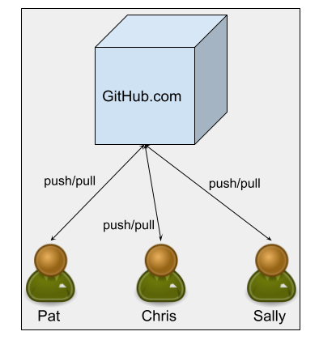

# Introduction to `git` <!-- omit in toc -->

> :bangbang: :mage_woman: **Faculty**
>
> Each semester _after creating the instance in GitHub Classroom_,
> we need to (in the version of the repository generated by GitHub Classroom once you accept the assignment):
>
> - [ ] Create a team called "Everyone"
> - [ ] Fix the URLs in the badges below so they point to that semester's
>     repository instead of the "starter" repo.
> - [ ] Make sure we've added every student in the current semester
>     to that semester's organization so they'll have permission to
>     push to this repo.
> - [ ] [Turn off branch protection](docs/FACULTY_BRANCH_PROTECTION_SETTINGS.md)
>     so that students can `push`.
> - [ ] Remove this note and the broken badge above in the fork.
>
> We should leave these notes in the copy in the "starter"
> repository so it's there each semester when we fork this.

- [Background](#background)
  - [Resources for learning `git` and friends](#resources-for-learning-git-and-friends)
  - [How we're going to use `git`](#how-were-going-to-use-git)
  - [Configuring your `git` e-mail](#configuring-your-git-e-mail)
- [We're ready to start the lab](#were-ready-to-start-the-lab)

## Background

This is an in-lab exercise where we'll introduce and practice several of the
key features of [the `git` version control system](https://git-scm.com/),
and [the GitHub repository hosting service](https://github.com/).
We'll provide command line means of accomplishing
the various tasks in the first part of this lab. For the second part of the lab, we'll
provide info on how to use [GitKraken](https://www.gitkraken.com/git-client) along with
[Visual Studio Code (VS Code)](https://code.visualstudio.com/) since
those tools will be part of our primary workflow this semester. `git` is essentially
a command line tool, and it can be difficult to visualize branching and history;
GitKraken provides a nice GUI for `git` which we find quite helpful for understanding
what's going on. VS Code is our IDE (basically our fancy program editor); there are lots
of alternatives, but we've been very happy with VS Code over the past few years.

:bangbang: While in most labs it will be fine for groups to move ahead
at their own pace, in this lab we'd like people to keep together
because there are moments where we're expecting certain things to
happen (e.g., merge conflicts) and we want everyone to be in roughly
the same place when that happens.

### Resources for learning `git` and friends

This lab experience definitely will _not_ provide a comprehensive overview of the
_many_ features `git` provides, and there are a _lot_ of on-line resources
that can provide additional information.

Below are some resources that you might want to look at right away
to help you get up to speed on `git` and its
friends:

- A few of the _many_ GitHub tutorials and
  docs. There are a _lot_ more than just these, but these are short and pretty easy to spin through, and cover the key concepts we’ll need at the beginning of the semester.
  - [GitHub Hello World](https://guides.github.com/activities/hello-world/) (a really nice,
    short introduction to the key ideas)
  - [Getting started with GitHub](https://docs.github.com/en/free-pro-team@latest/github/getting-started-with-github)
  - [Understanding the GitHub flow](https://guides.github.com/introduction/flow/)
- [The GitKraken tutorial videos](https://www.gitkraken.com/learn-git)
  - The beginner tutorials would be the
    obvious place to start; over time,
    though, we’d encourage you to work through
    the more advanced ones.

As well as reading this README document, you should read two other pieces
of documentation we have in the `docs/` folder:

- [A discussion of how to avoid merge conflicts and deal with them when they (inevitably) happen](docs/MERGE_CONFLICTS.md)
- [An overview of the Gradle build tool and how we're using it in this lab](docs/Gradle_README.md)

You should also probably read [Mastering Markdown](https://guides.github.com/features/mastering-markdown/).
Markdown is the markup language used by Slack, GitHub, and _many_ other
online tools, so understanding at least the basics is really valuable.

Below are some additional resources that you might
want to (re)visit over time as you become more
experienced with `git` and want to use some of
its more advanced features.

- The excellent [Atlassian `git` tutorials](https://www.atlassian.com/git/tutorials/what-is-version-control)
- [The "standard" `git` documentation site](https://git-scm.com/documentation),
which also includes links to videos, cheat sheets, and such
- [`git` – the simple guide](http://rogerdudler.github.io/git-guide/),
a single-page app that goes through the major features of `git`
- [A little on-line "game" for learning how branching works in `git`](https://learngitbranching.js.org/)

As circumstances allow, you might also want to at least skim one or two of the
tutorials listed above.

> [We'll also be using _Gradle_](docs/Gradle_README.md),
> a tool for building and running programs. We'll be
> using Gradle throughout the course, so it's useful to see it a bit here. We also
> use it to automate the tests for this project, which allows GitHub Actions to
> automatically run our tests whenever someone makes a change, and holler at us if
> someone breaks the tests.

The discussion below assumes that people are paired up in the lab, but we want
to make sure everyone has hands on experience with these tools and ideas.
This sort of _pair programming_ will be common throughout the class and
beyond, with two people working together. It is common in these settings for
one person (the _driver_, say Pat) to be at the keyboard, while the other person (the
_navigator_, say Chris) is actively engaged in working with Pat, suggesting ideas, noticing typos,
and answering questions. For this process to work, both of you have to
contribute and be involved, and it's extremely important for you to trade
off the roles of driver and navigator now and then. Thus in this lab
there will be times where we'll explicitly ask you to trade roles so that
everyone has a chance to go through all the activities.

### How we're going to use `git`

`git` is a piece of software which provides distributed version control, allowing
a team of developers to work together on a project, helping manage
collaboration and change. We're going to use three related tools:

- `git` is the fundamental program. It was originally developed to help manage
  change in the Linux
  operating system codebase, and it underlies the next two tools. `git`
  organizes projects into _repositories_, which are collections of files and
  the histories of all the changes ever made to that project. It is a command
  line tool.
- GitKraken is a GUI for `git` that provides a nice visual interface to `git`
  and displays of complex things like `git` histories and branching.
- _GitHub_ is a web-based software service that allows people
  to host, search, and manage repositories created and managed with `git`.

You could use `git` without ever using GitKraken or GitHub. We've found that a
good GUI like GitKraken can be a big help when things get complicated. GitHub
is an extremely popular repository hosting service, and it's a good idea for
computing folks to be familiar with it. We use it to manage
[all the labs for this course](https://github.com/UMM-CSci-3601), and you'll
use GitHub to manage all your labs and project iterations in this course.

This lab essentially has two halves:

- Adding your names in separate Markdown files
- Adding your greetings in the Java code

We'll use command line `git` for the first half so you have some exposure to
using `git` on the command line. This is important because you don't always
have GUIs (for example, when you're remotely logged into some cloud
server). We'll then use GitKraken in the second half, also mentioning how you'd
accomplish some of the new `git` tasks on the command line.

When you use `git` and GitHub, you typically have a single "primary" copy
of your repository hosted on GitHub; this will be visible to everyone in
your group (and the world if the project is public),
and will be the "copy of record". People will transmit changes through that
copy, and use GitHub tools like _issues_, _pull requests_, and _code reviews_
to discuss potential changes.

Each developer then has one or more private copies of the repository
(called _clones_) that they make local changes to. They can pull changes
from the GitHub repository into their local repository, as well as push
local changes up to the GitHub repository so that other people can access them.

In the diagram below, each of Pat, Chris, and Sally would have their own copy
of the repository on their computer, and they would use `git` to `push`
changes up to GitHub and `pull` changes (that other people made) down to
their copy. Thus they're all effectively communicating with each other
through GitHub as the shared "truth".

### Configuring your `git` e-mail

:warning::exclamation::warning:
This whole section will be irrelevant for people that already have done
this configuration step, either because you did it by hand (perhaps
for another class) or used a tool like
GitKraken that set all this stuff up for you. To see if you're already set up,
run the following two commands on the command line, and confirm that they
return the email you used when
you created your GitHub account, and your user name as you'd like it
to be displayed in things like commit messages and on GitHub.

- `git config --global user.email`
- `git config --global user.name`

If both of those look right, ignore the rest of this. You're done
with the setup and ready to start the first half of the lab exercise!

If either or both don't return the values you want, then follow along
below to set that up. Ignore everything from here to the end of this
section if your settings are correct.

---

Before we actually start to _use_ `git`, you should [configure your `git`
email so work you do in our lab properly connects to your GitHub
account](https://help.github.com/articles/setting-your-commit-email-address-in-git/).
You only need to do this once and it will "stick" throughout the course
(and beyond) in all systems that use `git`.

- Open a terminal window
- Type `git config --global user.email "email@example.com"` where
  you replace `email@example.com` with the email you used to set up
  your GitHub account.
- Verify that it worked by typing `git config --global user.email`;
  you should get the address you just configured as the response.

If you want to use a different e-mail address than the one you
signed up for GitHub with (e.g., you signed up with a non-U
email but you'd like to use your UMM email now) you can
[set your commit email address on GitHub](https://help.github.com/articles/setting-your-commit-email-address-on-github/)
so that they match.

:warning: If you'll occasionally be using any non-lab machines (like your own computer)
to do work, make sure you [set your `git` email](https://help.github.com/articles/setting-your-commit-email-address-in-git/)
on those machines as well. This will ensure that no matter where
you commit from, `git` and GitHub will "know" it's you and properly
credit you for your work.

## We're ready to start the lab

There are two parts to the lab:

- In [the first part](PART_1_SHARE_INFO.md) we'll all share some info through `git`
- In [the second part](PART_2_JAVA_INTRODUCTIONS.md) we'll take it up a notch and
  collectively edit a single Java program, using `git` to manage all the possible
  conflicts that might arise.

:warning: DO NOT START THE LAB until lab time and the instructor asks everyone to
start up. Unlike many labs, it's fairly important that everyone should stay in sync
in this lab, and if you start early that might complicate things.
