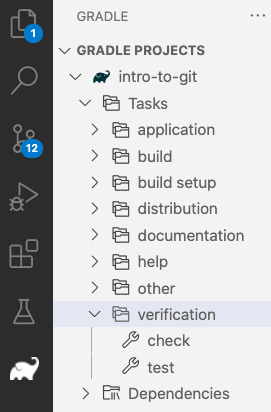

# How we're using Gradle <!-- omit in toc -->

We're using [the Gradle build tool](https://gradle.org/) to help automate
building, testing, and deploying our projects throughout this class.

- [Setting up Gradle](#setting-up-gradle)
- [Running Gradle](#running-gradle)
  - [Gradle on the command line](#gradle-on-the-command-line)
  - [Gradle in VS Code](#gradle-in-vs-code)

## Setting up Gradle

To enable the use of Gradle you need to have a `build.gradle` file at the
top level of your project.
[The `build.gradle` file for this project](../build.gradle) looks
like (minus all the comments):

```groovy
plugins {
  id 'application'
  id 'jacoco'
}

java {
  toolchain {
    languageVersion = JavaLanguageVersion.of(21)
  }
}

repositories {
  mavenCentral()
}

dependencies {
  testImplementation 'org.junit.jupiter:junit-jupiter-api:5.10.1'
  testRuntimeOnly 'org.junit.jupiter:junit-jupiter-engine'
  testRuntimeOnly 'org.junit.platform:junit-platform-launcher'
}

application {
  mainClass.set('hellos.Main')
}

test {
  useJUnitPlatform()
}
```

The two lines in the opening `plugins` section tell Gradle that we want to
build a stand-alone command-line application using Java.
That actually gives us a _bunch_ of Gradle commands we can run that know
how to build, run, test, and deploy a Java application. The `jacoco`
plugin gives us tools for determining which parts of our code are covered
by our JUnit tests.

The `java / toolchain` section specifies which version of Java we're using.
If Gradle can't find that version of Java on the computer you're using, it will
in fact download a project-specific copy of that version of Java and use it for
all the Gradle commands you run.

The `repositories` section allows us to provide one or more repositories where
Gradle can go to download libraries that our project depends on. We're using [`mavenCentral()`](https://search.maven.org/), which is the Maven Central Repository.

The
`dependencies` section tells Gradle that in order to compile our
_test_ code (i.e., `testImplementation`) we need the specified version
of the JUnit test library. This management of dependencies is
one of the most useful things about Gradle, as project dependency management
can be a real pain.

The `applications` section lets you specify application-specific information. In
this case we use the `mainClassName` entry to tell Gradle which class has the `main()`
method that should be run when we start up our application. This needs to be a fully
qualified path, so in this case `hellos.Hellos` for the class `Hellos` in the package
`hellos`.

In the `test` section we specify (via `useJunitPlatform()`) that we want Gradle to
use JUnit to run our tests. If we were using a different Java test platform like
[TestNG](https://testng.org/doc/) then we would indicate that here. There's some
additional configuration there that tells Gradle to use Jacoco to compute the
test coverage, and fail the build if our tests don't cover at least 80% of our
code.

There are a _lot_ more nifty things you can set up in a `build.gradle` file,
but this is all we need for this lab.

## Running Gradle

This simple setup creates a _lot_ of Gradle commands that we can use to build and
run our application. These can be done through VS Code or on the command line.

### Gradle on the command line

You can run Gradle on the command line, which is extremely useful since
you don't a fancy IDE at your disposal. Worse, if you're
logged in to a server via a terminal, you probably _can't_ run an IDE, so
command line Gradle is a real win there.

If you've got Gradle installed locally, you can use the `gradle` command
to run tasks, e.g., `gradle check`. That makes you dependent on having
(the right version of) Gradle installed locally, which can be a problem.
So instead we're using `gradlew` (Gradle Wrapper), which is a script which
downloads the correct version of `gradle` if necessary and then runs that.
This ensures that you'll always be running the same version of Gradle no
matter which machine you're using.

To run tasks with Gradle Wrapper, use `./gradlew <task>` in the top-level
directory of the project. There are a _lot_ of tasks; some of particular
interest include:

- `./gradlew check` will run all yours tests and check your code style.
- `./gradlew run` will run your application.
- `./gradlew build` will compile all your files and run tests and checks.
- `./gradlew clean` will delete all the generated files (e.g., `.class`
  files), which can be helpful when it looks like you need to force a
  rebuild. It's also a nice thing to do when you're done working on a
  project for a while and want to clean up some disk space.
- `./gradlew jar` will generate a standalone JAR file for your application.
- etc., etc.

### Gradle in VS Code

"Out of the box", VS Code doesn't give you any way to run Gradle Tasks.
If you install the [Gradle for Java](https://marketplace.visualstudio.com/items?itemName=vscjava.vscode-gradle)
extensions then you get a "Gradle" view, which is an elephant
icon along the left side of the VS Code window.



That will have a "folder" with the name of the repo (`intro-to-git` or
similar in this case). That which will contain many other folders
containing specific tasks. Some of particular interest:

- _application -> run_ will run your application
- _build -> build_ will compile all your files
- _build -> clean_ will delete all the generated files (e.g., `.class`
  files), which can be helpful when it looks like you need to force a
  rebuild. It's also a nice thing to do when you're done working on a
  project for a while and want to clean up some disk space.
- _build -> jar_ will generate a standalone JAR file for your application
- _verification -> check_ will make sure everything builds and the tests all pass

Running these from VS Code is equivalent to running the same tasks from the
command like, e.g., `./gradlew run` or `./gradlew check`. Note that on the
command line, however, there's no "folder" name like "application" or
"verification".
