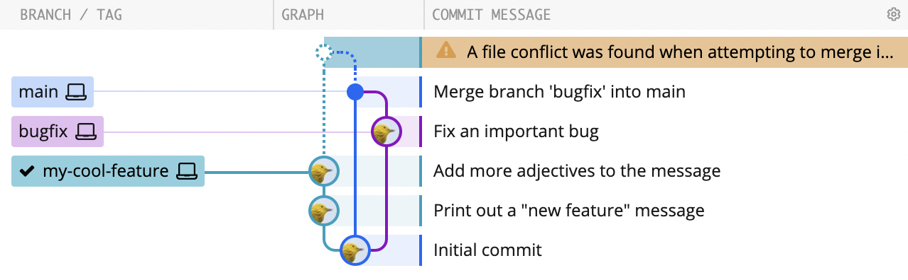
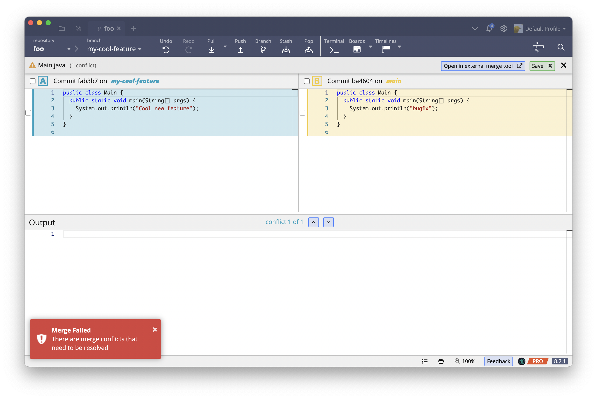
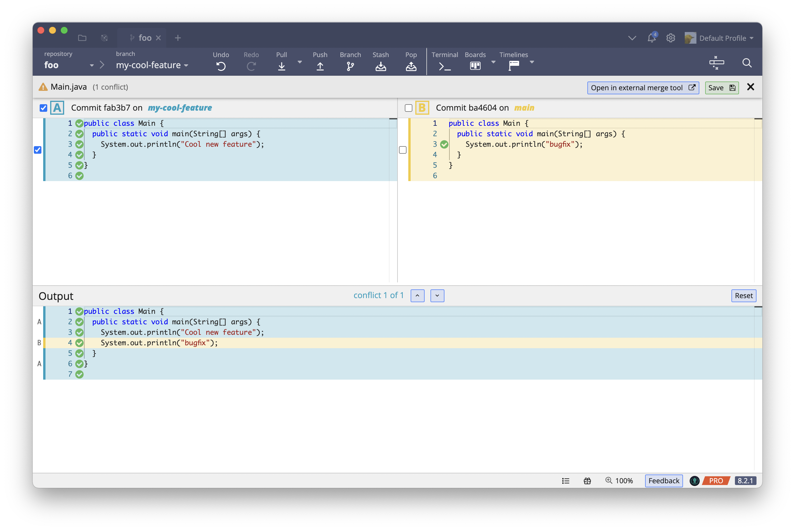
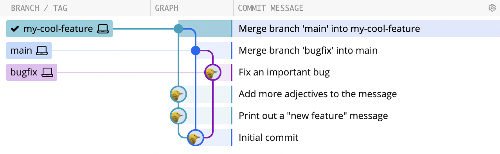

# Info on merge conflicts <!-- omit in toc -->

- [What is a merge conflict \& why do they matter?](#what-is-a-merge-conflict--why-do-they-matter)
- [Pro-tip: Keep your branch(es) up-to-date](#pro-tip-keep-your-branches-up-to-date)
- [How to deal with merge conflicts](#how-to-deal-with-merge-conflicts)
  - [Make sure you have the latest version of `main` locally](#make-sure-you-have-the-latest-version-of-main-locally)
  - [Initiate a merge from `main` to your feature branch](#initiate-a-merge-from-main-to-your-feature-branch)
  - [Resolve the merge conflict](#resolve-the-merge-conflict)
  - [Push your feature branch to GitHub](#push-your-feature-branch-to-github)

## What is a merge conflict & why do they matter?

Working as part of a team on a shared repository can be tricky.
If no one else was working on the repository, life would be easy, and
you'd (probably) never have any merge conflicts. But there are other
people working on the repository, and you have to make sure you play
nice with them.

And that can be tricky because other people may have
`push`ed commits up to GitHub, and those commits might conflict with your
changes. Say, for example, Pat and Chris separately notice that someone
(who shall remain unnamed) named a variable `foo`. Chris and Pat both
replace
that content-free name with a more informative name without realizing the
other person was changing the same piece of code. They made different
but reasonable choices: Pat renamed it to `sum` and Chris renamed it
to `total`. If Pat merges the change to `sum` in first, then when Chris
tries to merge in the change to `total`, there will be a merge conflict.
`git` will realize that the commits from both Pat and Chris changed the
same piece of code, but there's no way for `git` to figure out what
the "right" thing to do is, though. So `git` will block the second
merge (from Chris), generate a _merge conflict_, and ask Chris to _resolve_
the conflict by deciding which change to use.

Dealing with merge conflicts, especially complex ones, can be a real headache,
but these tips can help reduce the likelihood of pain arising from
merge conflicts:

- Merge changes into your development branch(es) early and often. The
  more consistent your branch is with `main` (or whatever branch you're going to
  merge into), the less likely there will be conflicts, and
  they'll tend to be smaller when they do happen. The
  history/branch visualization in GitKraken can
  give you a sense of how far your branch is from what's on `main`.
- Break your work into small, manageable stories/tasks/chunks. Small,
  well-defined bits of work tend to touch less code and be completed more
  quickly, both of which reduce the likelihood of a nasty conflict surprise
  when you come to merge.
- Give yourself plenty of time to merge into `main`. You don't want to decide
  you're going to merge into `main` at 2am or 15 minutes before Food Service
  closes for dinner; if there's an unexpected conflict you don't have the
  time and energy to deal with it properly and your chances are much higher that
  you'll do something you'll regret.
- Don't do (big) merges alone (or at least make sure other folks are around).
  This relates to the previous tip. If you're caught off guard by a conflict,
  and you're in a hurry, and there's no one around to help you understand how
  your changes relate to and will affect changes other people have made,
  Badness is very likely to ensue.

## Pro-tip: Keep your branch(es) up-to-date

Suppose you're working on a new feature, and you have all of your changes in a branch called
`my-cool-feature`. In the meantime, one of your classmates fixed a bug and
merged the change into `main`. To make sure the bugfix is on your feature
branch as well, you'll want to merge `main` into `my-cool-feature`.

Since the `my-cool-feature` branch doesn't include all of the latest changes to
`main`, we say that it's _out of date_. You want your feature branch to be
up to date before you merge it into `main`&mdash;if it's out of date, the merge
to `main` might not be clean.

Many projects, including ours, block pull requests from out-of-date branches as
a safety measure. So, you'll need to bring your branches up to date before
merging your pull requests.

In general you want to keep your branch as up-to-date with `main`
as possible, merging changed from `main` into your branch
as often as you can.
The longer you wait to merge changes in from `main`, the harder
it will be and the more likely it is that you'll have merge
conflicts when you do.

Branches that get really disconnected from `main` often get
abandoned because merging that work in just becomes too much
hassle, and lots of potentially good work gets "lost"
that way.

In the next section we'll go over the mechanics of getting
your branch up to date with `main`.

## How to deal with merge conflicts

When bringing your branches up to date, you might encounter merge
conflicts. Here's how to deal with them!

### Make sure you have the latest version of `main` locally

Since other people have made changes to `main`, the copy of `main` on your
computer is probably a few commits behind `main` on GitHub (`origin/main`). So
you should first make sure to `pull` any changes other people have made into
your copy.

The basic process you'll typically want to follow is:

- Make sure all your changes on your feature branch are committed locally.
  - In GitKraken if there's no `WIP` entry at the top then you know all your changes are
    committed. If there is an `WIP` entry, you can click on it to see what's
    not yet committed. (There can be times where you have changes you don't
    yet want to commit, but these can interfere with the process. Feel free
    to [create a _stash_](https://help.gitkraken.com/gitkraken-client/stashing/)
    as a way to temporarily store those changes so you
    can get them back later.)
  - Alternatively, you can use `git status` on the command line to confirm that
    everything you meant to have committed is in fact committed.
- Check out the `main` branch
  - Double click on `main` in the branch listing on the left-hand side
    of GitKraken.
  - Or `git switch main` on the command line

At this point you should be on the `main` branch, and all your work
on your new feature should "disappear" in VS Code. Don't worry, it's still
there in your feature branch, but it's not part of `main` so it's not
visible when we have `main` checked out.

Next, you'll want to get the new changes from GitHub.

- Click the `Pull` button in GitKraken,
- Or run `git pull` on the command line.

Assuming you've _only_ made changes to your group's special development
branch, this `pull` should succeed with no difficulties, and `git` will
merge in whatever changes other people have `push`ed up to `main` on
GitHub into your copy of `main`. You might want to re-run the tests in
VS Code, though, just to make sure someone hasn't broken things.

### Initiate a merge from `main` to your feature branch

Now we have the moment of truth, where you merge the changes on `main` into
your feature branch.

- In GitKraken, drag the label with the branch name that you want to merge
  (e.g., `main`) onto the branch you want to merge into (in this case
  `my-cool-feature`). That will bring up a dialog with several options.
  Go with the first one (probably "Merge", but possibly "Fast-forward").
- On the command line
  - Run `git switch -c my-cool-feature` to check out the
    feature branch
  - Then run `git merge main` to merge in the new changes from `main`.
    - On the command line, `git merge <branch-name>` will merge the specified
      branch into whichever branch is currently checked out.

If you're lucky, any changes you've made won't conflict
with changes other people have made and the merge will succeed immediately.
That likely won't be the case in this lab,
as the changes other groups have made to the program (or changes we made
while you were working on the first part of the lab) will almost certainly
conflict with your work.

### Resolve the merge conflict

Dealing with these kinds of merge conflicts can be a frustrating
experience, but GitKraken has a nice GUI merge conflict tool that makes
it a little easier. The merge tools in VS Code are also quite nice; we'll describe
GitKraken here, but you should feel free to use whichever you find most useful.

The sequence of events in GitKraken is likely to look something like:

- The attempt to `merge` will lead to a conflict; you'll have a message like
  "A file conflict was found when attempting to merge" up at the top of the
  commit history graph.

- All the files with merge conflicts will be listed in the "Conflicted Files"
  panel on the right hand side.
- Select a file with a conflict. That should bring up a GUI for resolving
  merge conflicts with one version (`main` in this case) on the top right,
  the version we're trying to merge in (e.g., `my-cool-feature`) on
  the top left, and the `Output` (the result of the merge) at the bottom.

- You can then choose sections (using the checkboxes) that you want to include
  in the finished result. You can even choose to include (or not include)
  individual lines if you wish. The sections or lines you select
  will be added to the result below in the order in which you
  select them.

- When you're done click `Save`.
- That will move that file to "Staged Files", and you can commit the changes
  like normal.

### Push your feature branch to GitHub

When that's all done then the merge conflict will be (in `git` terminology)
_resolved_, and you'll be (nearly) read to `push` your changes.

Before you do that, however, you should carefully
proofread any code that's modified in resolving a merge conflict,
as it's easy to introduce mistakes in that process.
You'll want to make sure you re-run the test suite, for example, to make
sure that resolving the merge conflict didn't inadvertently break something.

If, after resolving the merge conflict, your tests are failing, don't despair.
You can fix the tests in VS Code, and then commit those fixes separately.

Once that's all happy, you should `push` your feature branch up to GitHub!

Hopefully, at this point, your branch should be up-to-date with `main`.
Occasionally, however, someone will manage to sneak in another change to `main`
while you were resolving your merge conflict&mdash;and that's actually
pretty likely in this lab with so many people working in parallel on the same
file.

If that happens, `pull` the latest `main` branch again, merge it into your
feature branch, resolve any conflicts (including running the tests, etc.), and
push your feature branch to GitHub. It's entirely possible that this could take
several rounds before you get your feature branch is up-to-date, but it will
eventually happen.
